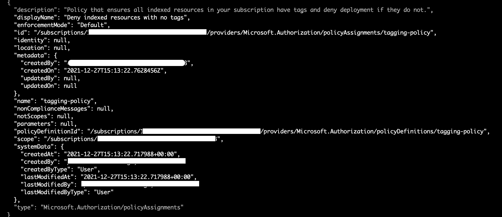
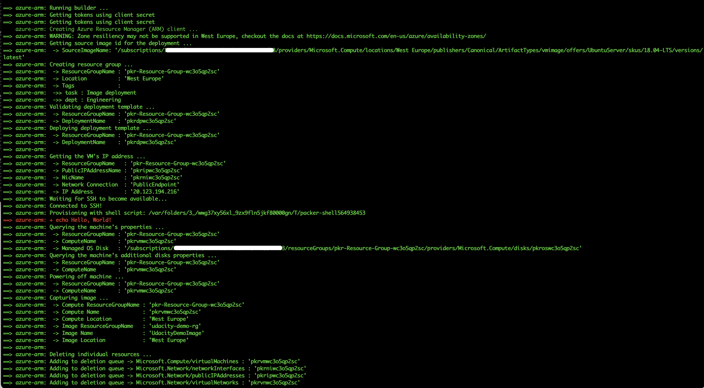
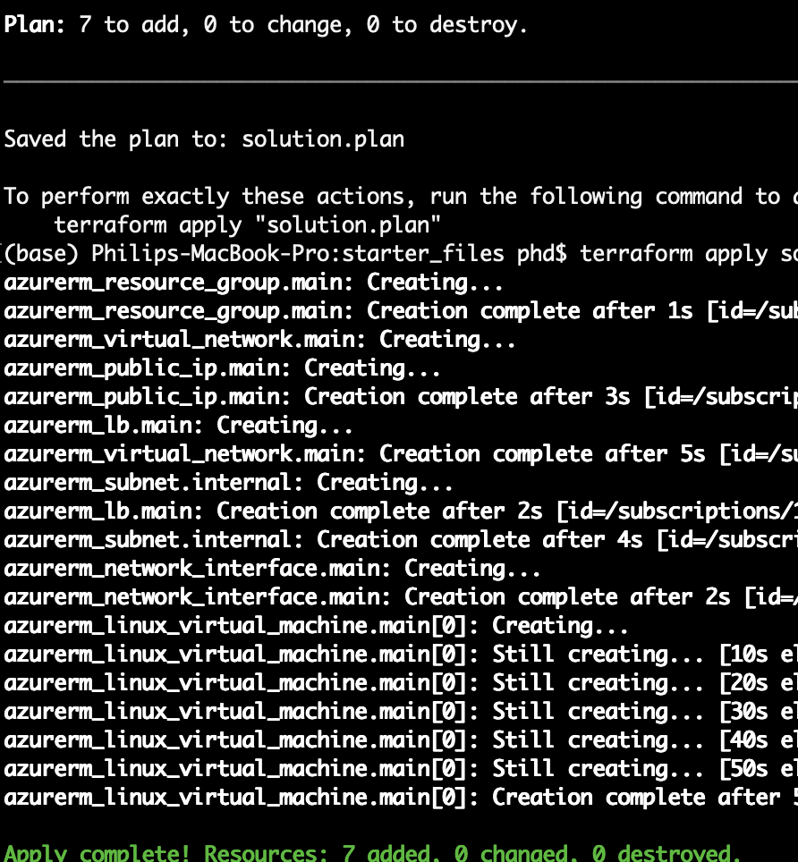
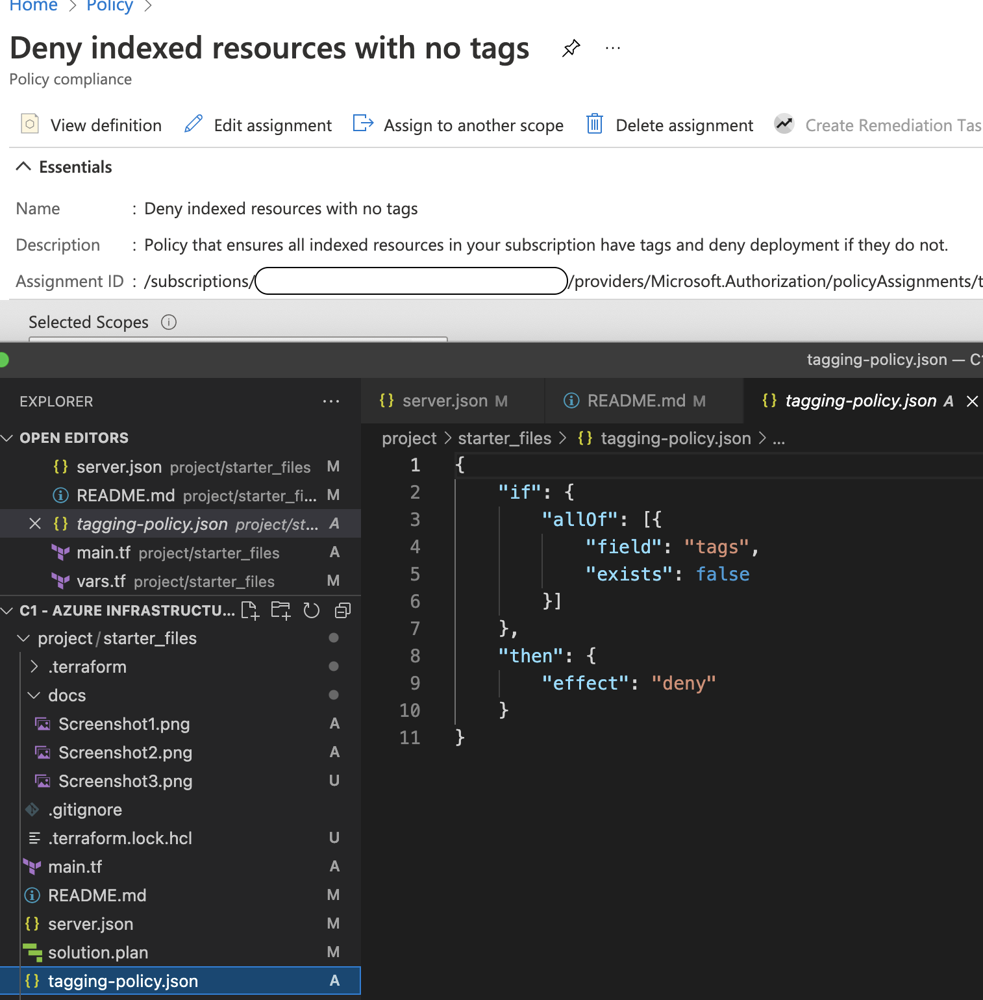

# Azure Infrastructure Operations Project: Deploying a scalable IaaS web server in Azure

### Introduction
For this project, you will write a Packer template and a Terraform template to deploy a customizable, scalable web server in Azure.

### Getting Started
1. Clone this repository

2. Create your infrastructure as code

3. Update this README to reflect how someone would use your code.

### Dependencies
1. Create an [Azure Account](https://portal.azure.com) 
2. Install the [Azure command line interface](https://docs.microsoft.com/en-us/cli/azure/install-azure-cli?view=azure-cli-latest)
3. Install [Packer](https://www.packer.io/downloads)
4. Install [Terraform](https://www.terraform.io/downloads.html)

### Instructions

#### Deploy Policy
Create a policy *"tagging-policy.json"* that ensures all indexed resources are tagged. This will help us with organization and tracking, and make it easier to log when things go wrong.

```bash
az policy definition create \
	--name "tagging-policy" \
	--description "Policy that ensures all indexed resources in your subscription have tags and deny deployment if they do not." \
	--display-name "Deny indexed resources with no tags" \
	--mode indexed \
	--metadata version="1.0.0" categories="Tags" \
	--rules tagging-policy.json
```

Assign the policy
```bash
az policy assignment create \
	--name "tagging-policy" \
	--description "Policy that ensures all indexed resources in your subscription have tags and deny deployment if they do not." \
	--display-name "Deny indexed resources with no tags" \
	--policy tagging-policy
```
To verify policy use:

```bash
az policy assignment list
```

#### Prepare image with Packer
Using packer and resource group with name **udacity-pr1-rg**

Create client credential with secret from the Azure Directory or with

```bash
az ad sp create-for-rbac --query "{ client_id: appId, client_secret: password, tenant_id: tenant }"
```

Then run the packer build with your appId, created secret and subscription id. Subscription id can be seen in the portal or with

```bash
az account show --query "{ subscription_id: id }"
```

```bash
packer build server.json \
	-var "client_id=appId" \
 	-var "client_secret=password" \
	-var "subscription_id=subsId"
```

#### Create the infrastructure with Terraform 

```bash
terraform init
terraform plan -out solution.plan
terraform apply solution.plan
terraform destroy
```

### Output

Example output from policy assignment


Example output from packer build


Example output from terraform apply


Screencap of tags policy


